# Precision Grasper

[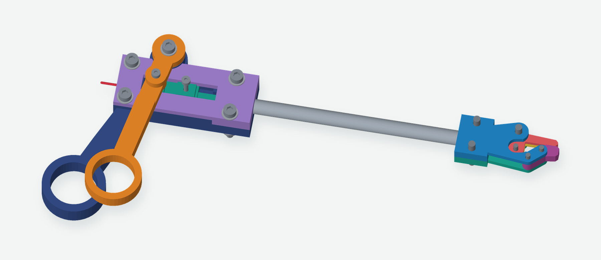](designs/guided-wire-handle/images/assembly.png)

A hand-operated precision grasper for dexterity practice and peeling grapes. Squeeze the lever to pull a wire through the metal tube and close the jaw; open it to push the wire back.

The newest handle provides **6 mm of wire travel** and **about 4.3:1 leverage**, matching the movement measured on the assembled v2 head. A sliding carriage guides the wire directly into the metal tube, and a through-hole lets excess wire exit the back. It reuses the v2 head, 116 mm tube, music wire, and the existing screw assortment.

**Status:** the v2 head is printed and assembled. Printing the 6 mm handle exposed a reversed cover: its print export was mirrored by mistake. **Corrected September 9:** print only the [replacement purple cover](designs/guided-wire-handle/bambu/guided-wire-cover-corrected-A1-PLA.3mf) if you already have the handle. The corrected part is digitally checked and sliced; its physical fit remains to be tested.

[Newest CAD](designs/guided-wire-handle/guided-wire-grasper.js) · [Guided-wire handle guide](designs/guided-wire-handle/README.md) · [Build log](#build-log)

## What to print

| Print | Files | Bambu A1 estimate |
| --- | --- | --- |
| Replacement purple cover — **September 9 correction** | [Cover-only 3MF](designs/guided-wire-handle/bambu/guided-wire-cover-corrected-A1-PLA.3mf) · [STL](designs/guided-wire-handle/stl/cover.stl) | **30 min / 4.83 g PLA** |
| Four guided-wire handle parts — **6 mm revision, corrected cover** | [3MF project](designs/guided-wire-handle/bambu/guided-wire-handle-A1-PLA.3mf) · [STL layout](designs/guided-wire-handle/stl/layout.stl) · [Assembly guide](designs/guided-wire-handle/README.md) | **2 hr 15 min / 28.55 g PLA** |
| Five head parts, only if you need a head | [3MF project](prints/fox-build-a1-head-v02/grape-grasper-head-v02-A1-PLA.3mf) · [Guide](docs/HEAD-V02.md) | **34 min / 4.49 g PLA** |

All projects use an A1 with a 0.4 mm nozzle, PLA, a textured PEI plate, 0.16 mm layers, and supports off. The handle uses five walls, 60% gyroid, and 2 mm brims. Confirm the installed nozzle and keep the supplied print orientations.

## The guided-wire handle

[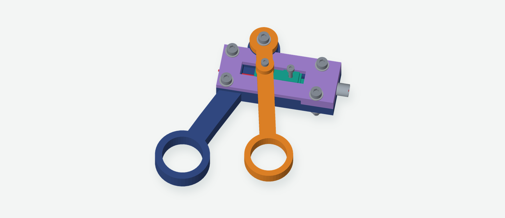](designs/guided-wire-handle/images/handle.png)

The orange lever drives the green carriage through a metal screw engaging a transverse slot. A second screw clamps the wire directly inside the carriage. Its narrow guide telescopes into the tube, retaining at least 0.6 mm overlap during the working stroke. The wire runs beneath the drive screw and straight out of the rear frame hole, so its length is easy to adjust.

Working wire travel is **6.0 mm**, with 6.4 mm between the stops. The finger ring moves about 26 mm. The drive slot has 0.3 mm nominal reversal play. The stops limit travel, not gripping force. The full-assembly image is a closed reference; JSCAD's **Wire advance (mm)** slider demonstrates the new handle's complete stroke in the handle views. See the [guide](designs/guided-wire-handle/README.md) for adjustment and hardware placement.

[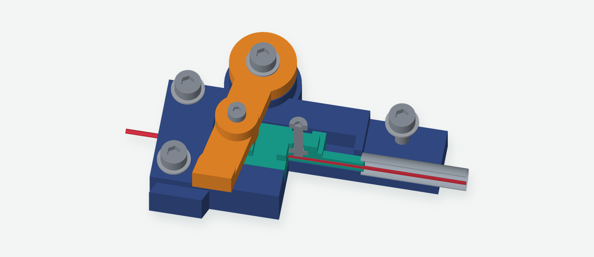](designs/guided-wire-handle/images/section-0.png)

The earlier [three-part direct-clamp lever](docs/LEVER-HANDLE.md) remains as a reference. Its long exposed wire span is why the guided version was developed. The root-level handle STLs and `precision-grasper.js` belong to that earlier design; use the new files linked above for this prototype.

## The printed head

[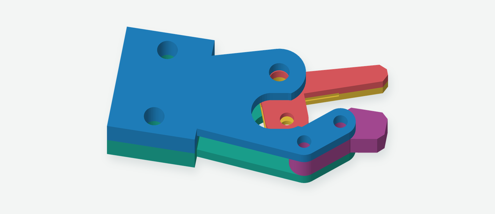](docs/images/head-v02.png)

The v2 head has two cheeks, two moving-jaw halves, and a fixed tip insert. Its closed printed envelope is **43 × 18.34 × 9.4 mm**, excluding fasteners. It printed and assembled successfully, although it still feels bulky for small openings.

The [compact metal-head plans](concepts/metal-head-v03/README.md) and [clip research](docs/CLIP-OPTION.md) are saved for later.

## Build log

### First PLA print — September 5, 2026

The handle printed well. The first head was bulky, and its raised features failed to print cleanly. That led to a smaller head made from flat-printing parts.

| On the printer | Head close-up |
| --- | --- |
| [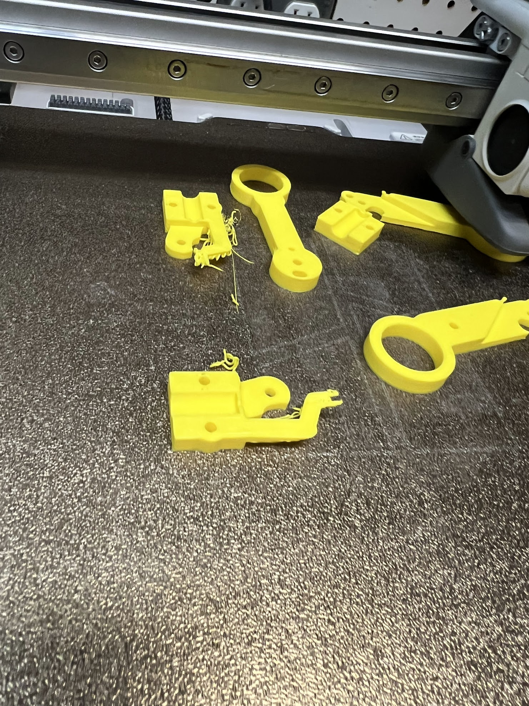](docs/build-log/first-pla-print/on-the-printer.png) | [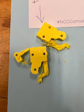](docs/build-log/first-pla-print/head-closeup.png) |

### v2 assembled — September 6, 2026

The revised head printed and was assembled on the metal tube. Moving the handle mechanism moved the jaw, but attaching the wire at the trigger remained awkward. A slimmer metal head was explored and saved for later.

[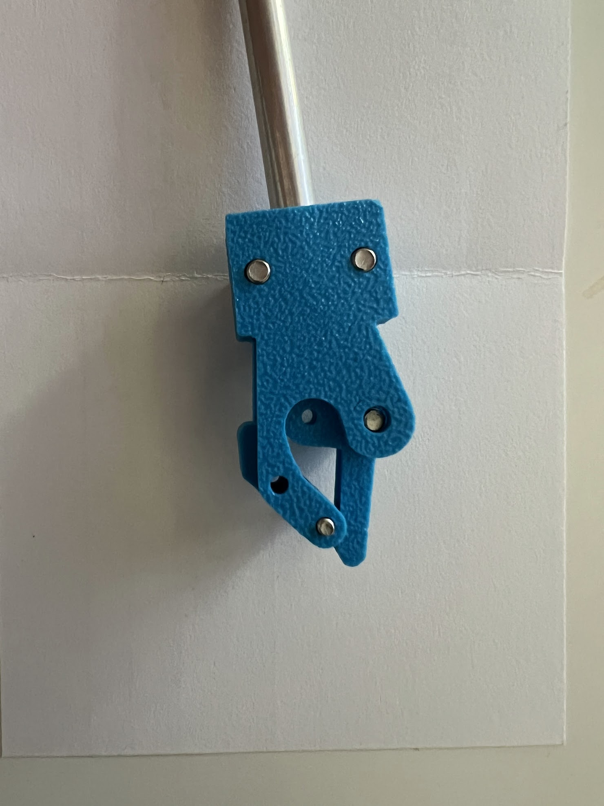](docs/build-log/v02-assembly/assembled-head.png)

### A simpler lever handle — September 6, 2026

The replacement handle starts fresh with a fixed grip, a squeeze lever, and a tube cap. One M2 screw clamps the straight wire directly in the lever, making its length easy to adjust. The long finger arm keeps the leverage.

The nut loads from the side, and a thin washer supports the lever pivot. This version was modeled and sliced. Its long exposed wire span raised a concern about bowing when pushed.

### Keeping the wire supported — September 6, 2026

A sliding screw clamp and fixed guide reduced the unsupported wire span at the handle. The first version had too little travel for the assembled head.

### Six millimetres and a rear wire exit — September 6, 2026

Measuring the assembled v2 head established a 6 mm wire stroke. The handle now provides that travel while retaining leverage. Its guide slides inside the tube, and excess wire passes beneath the drive screw and out the back. The four matching parts have been checked and freshly sliced for the A1: **2 hr 15 min, 28.55 g PLA**. That print exposed the cover orientation error described below.

### Cover orientation corrected — September 9, 2026

The 6 mm handle was printed, but the purple cover’s circular relief was on the wrong side. A wing had to be cut away to fit it. The print export had reflected the part instead of rotating it onto the bed; the assembly preview therefore looked right while the printed part was reversed.

The cover export and Bambu projects are corrected. Only the cover needs reprinting: **30 min, 4.83 g PLA**. The frame, lever, and carriage are unchanged. Checks now turn the exported cover over as a real part would be fitted and confirm that it clears the frame. An orientation audit found no other reversed parts in the current nine-part build. The replacement still needs a physical fit test.

## Parts to buy or find

The build uses **one of each of the three products below**. These are the recorded September 5 offers, not a new price or delivery check. Their full-pack subtotal was **$20.67** on Amazon on September 5, 2026, excluding tax, any shipping charges, tools, filament, and socket shims. Prices and availability can change; check the selected offer on Amazon before ordering.

Amazon links below are affiliate links. As an Amazon Associate I earn from qualifying purchases.

| Product to buy | Specification and use | Pack price |
| --- | --- | ---: |
| [K&S 8106 round aluminum tube — 1 tube](https://www.amazon.com/dp/B00FZS20P0?tag=rickcarlino-20) | **1/4 inch (6.35 mm) OD × 0.014 inch wall × 12 inches long**. Calculated nominal ID is **5.64 mm**. Cut one **116 mm** piece and deburr it. This is the lower-cost aluminum option for the metal shaft. | **$6.19** |
| [K&S 5497 music wire — 4 lengths](https://www.amazon.com/dp/B002WXPNA0?smid=A2E137HZ093DQ5&psc=1&tag=rickcarlino-20) | Select **0.039 inch OD × 12 inches long**, approximately **0.99 mm diameter**. Start with about **170 mm** before forming the head-end eye and trimming the straight handle end. This is carbon spring steel for the dry internal linkage, not the contact tips. The quoted offer is from **Hobbylinc**. | **$6.29** |
| [HanTof 900-piece hex socket head cap screw, nut, and washer assortment](https://www.amazon.com/dp/B0FF4RH81S?tag=rickcarlino-20) | Select **900-Pieces Set**, with M2, M2.5, and M3 hardware and black Grade 12.9 alloy-steel cap screws. The listed contents include **25 × M3 × 20 mm**, **25 × M2 × 12 mm**, **100 nuts and 100 flat washers of each size**, plus hex keys. One kit covers all the fasteners below. | **$8.19** |
| **Total: one tube pack + one wire pack + one hardware kit** | Extra wire and fasteners remain for spares and later builds. | **$20.67** |

Shipping is not included in the recorded subtotal. Confirm the current offer and delivery date at checkout.

### Hardware for the complete grasper

| Hardware | Quantity | Use |
| --- | ---: | --- |
| M3 × 20 mm screws and M3 nuts | 8 each | Handle pivot, four guide-cover screws, head pivot, and two head tube-clamp screws |
| M3 flat washers | 16 | Ten at the handle and six at the head; the washer below the lever is 0.5 mm thick |
| M2 × 12 mm screws and M2 nuts | 5 each | Head linkage, two fixed-tip screws, handle wire clamp, and lever drive pin |
| M2 flat washers | 6 | Head joints |

The guided handle uses five M3 screw/nut sets, ten M3 washers, and two M2 screw/nut sets. Its M2 nuts are nominally 4 mm across flats × 1.6 mm thick. The pivot M3 nut loads into the frame from below; there is no bottom washer at that joint.

Also needed: PLA, approximately 1 mm music wire, the 6.35 mm OD tube cut to 116 mm, and ordinary cutting, filing, measuring, and assembly tools. Both complete print plates use about **33.04 g of PLA** including brims.

## Files and checks

- [Newest design and assembly instructions](designs/guided-wire-handle/README.md): self-contained JSCAD, four STLs, images, and the new A1 project.
- [Motion checks](designs/guided-wire-handle/checks.json): 122 push/pull positions, nut and screw insertion, hardware clearances, and stop contact.
- [Mesh/layer checks](designs/guided-wire-handle/mesh-checks.json) and [slice checks](designs/guided-wire-handle/bambu/slice-checks.json): four closed meshes, no floating islands, matching embedded project meshes, first-layer paths, and G-code checksum.
- [Orientation audit](orientation-checks.json): all nine current parts match the intended assembly after physical rotations; the saved Bambu models match their STLs. The report also covers earlier parts and records its limits.
- [Head guide](docs/HEAD-V02.md): the existing v2 head is unchanged.

These are digital checks. Fit, grip, drive-slot wear, and PLA relaxation still need physical testing. The tube bore is much larger than the wire, so supporting the handle end does not rule out bowing inside the tube. Adjust the pivot screw for free rotation; fully tightening it can bind the lever. The old head CAD does not establish its as-built full-stroke clearances; use the actual assembled head when setting the wire length.

Earlier direct-clamp handle and unchanged head — reference STL previews

<!-- STL-GALLERY:START -->
<!-- Generated by scripts/render_stls.py; do not edit this section. -->
### Printable parts

Print one of each of the three handle parts and five head parts, or their two separate layouts. Keep an already assembled head. Dimensions shown are STL bounds; previews are individually scaled.

| Part | STL preview |
| --- | --- |
| [Fixed grip](fixed-grip.stl) | [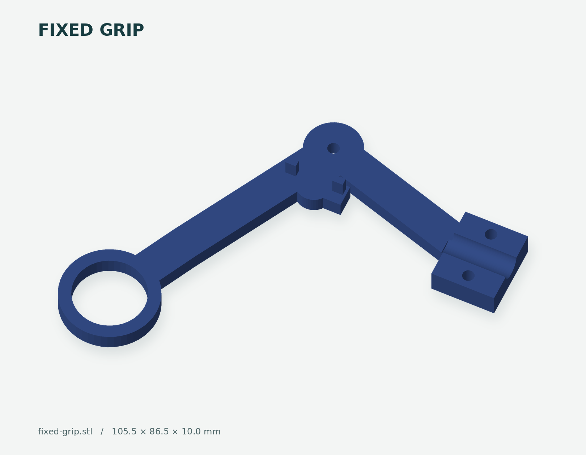](fixed-grip.stl) |
| [Squeeze lever](squeeze-lever.stl) | [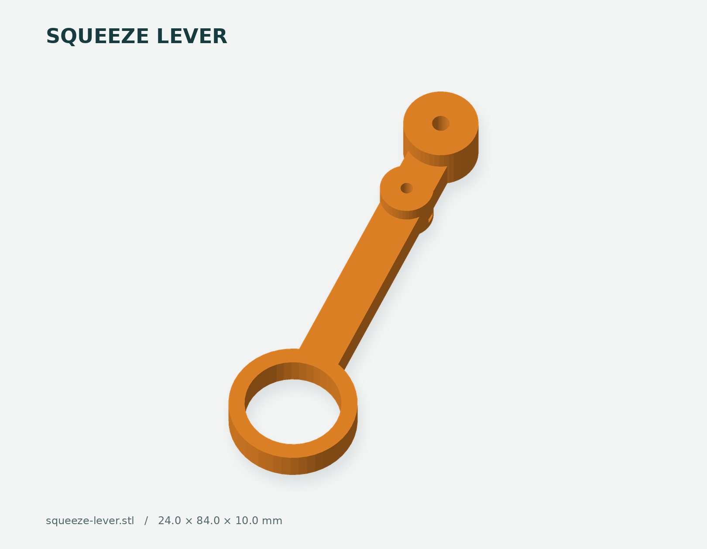](squeeze-lever.stl) |
| [Tube cap](tube-cap.stl) | [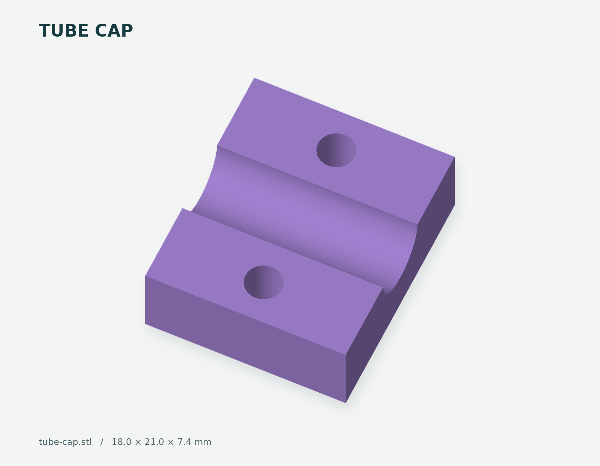](tube-cap.stl) |
| [Handle print layout](layout.stl) | [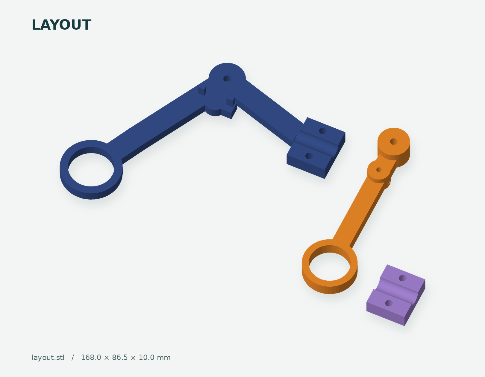](layout.stl) |
| [Nose A](nose-a.stl) | [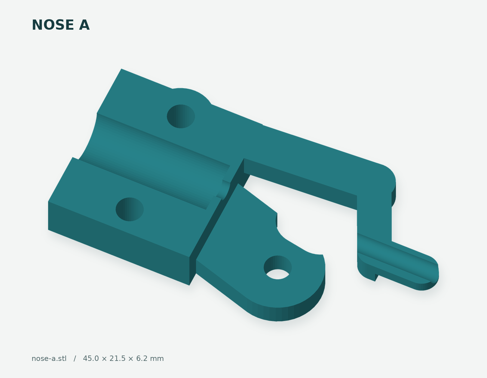](nose-a.stl) |
| [Nose B](nose-b.stl) | [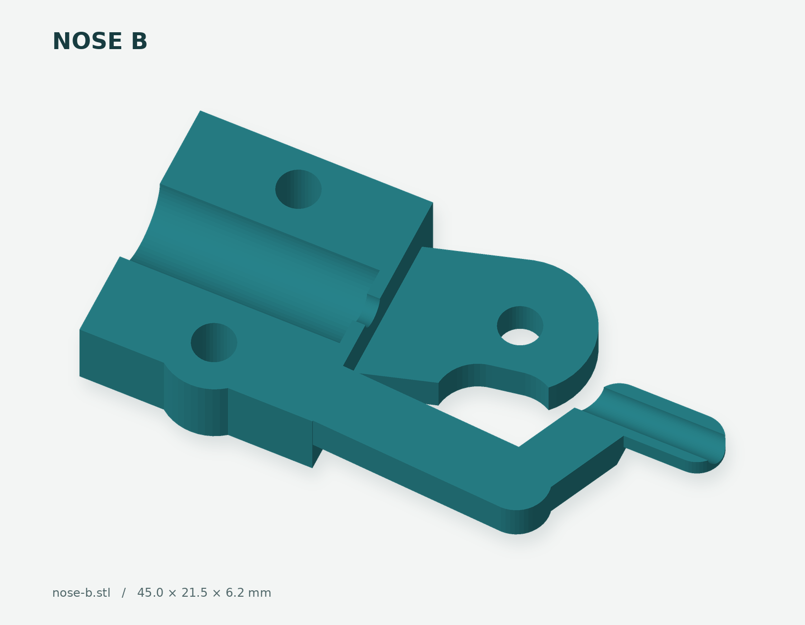](nose-b.stl) |
| [Jaw A](jaw-a.stl) | [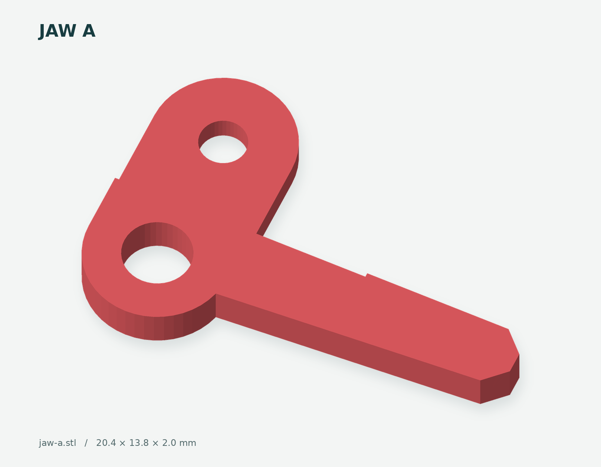](jaw-a.stl) |
| [Jaw B](jaw-b.stl) | [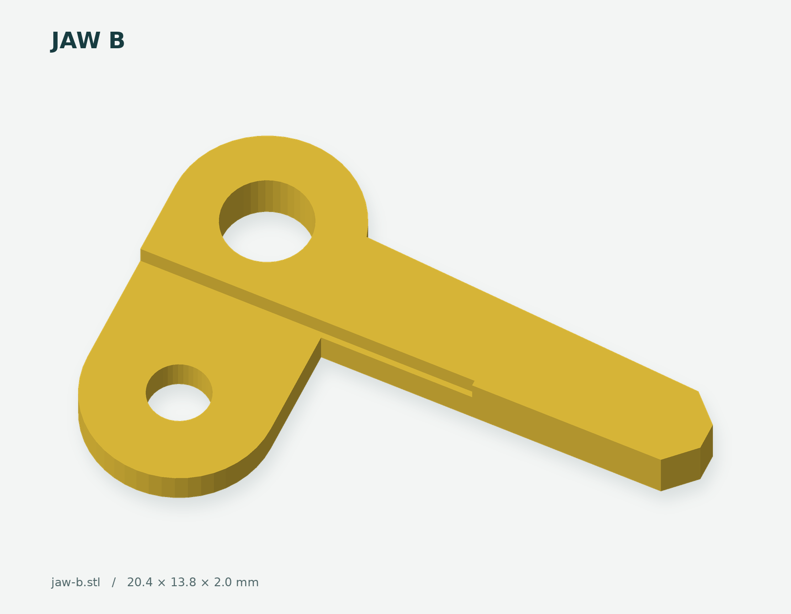](jaw-b.stl) |
| [Fixed tip insert](fixed-jaw.stl) | [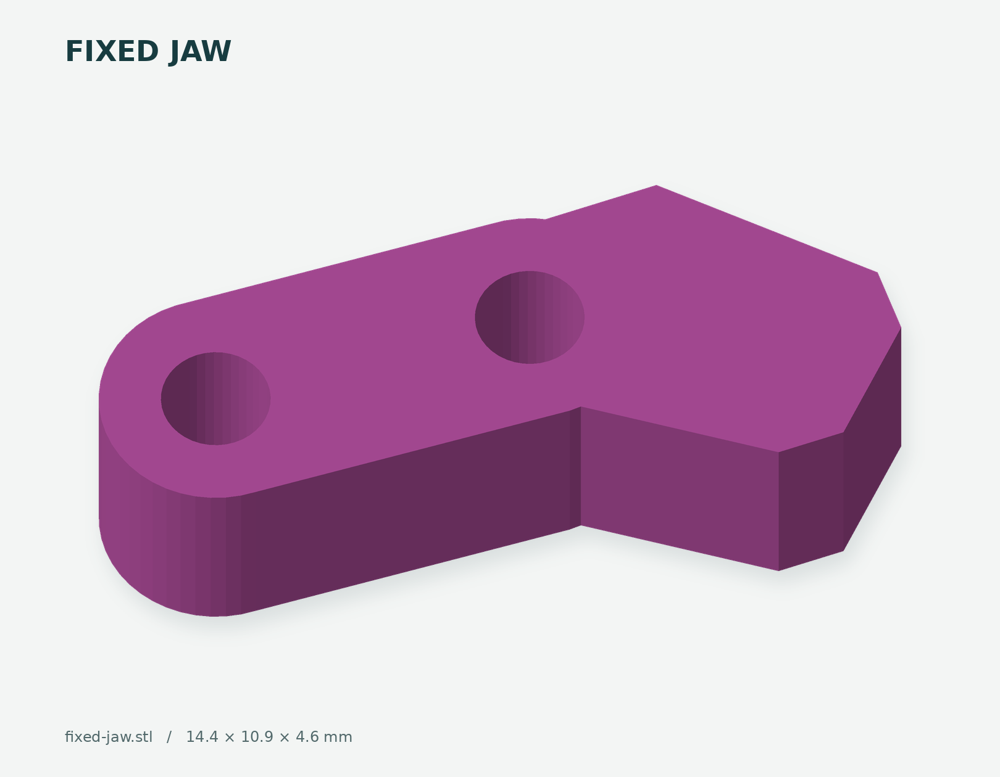](fixed-jaw.stl) |
| [Head print layout](head-layout.stl) | [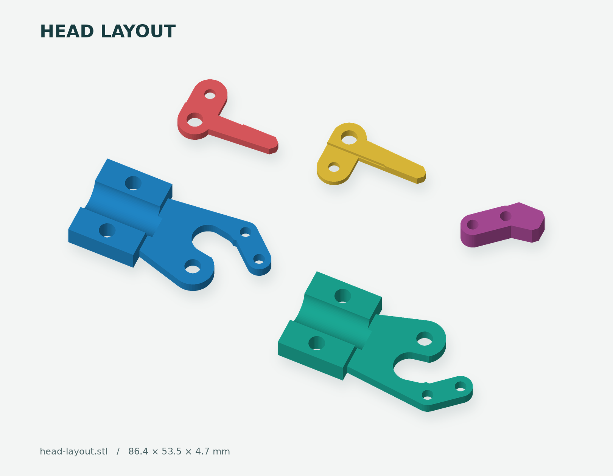](head-layout.stl) |
<!-- STL-GALLERY:END -->

## Rebuild and check

Use the [guided-wire build commands](designs/guided-wire-handle/README.md#checks-and-limitations) for the new model. They regenerate its source-derived STLs, images, and checks. The saved Bambu project must be resliced separately after geometry changes.

`make screenshots` and `node scripts/check_motion.cjs` still rebuild/check the earlier direct-clamp model retained at the repository root. Its images and STLs are reference files, not the new guided-wire handle.
