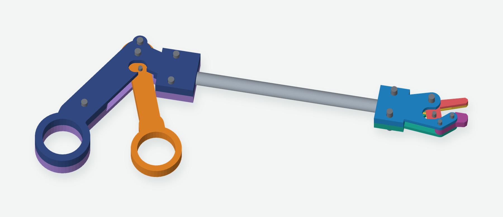
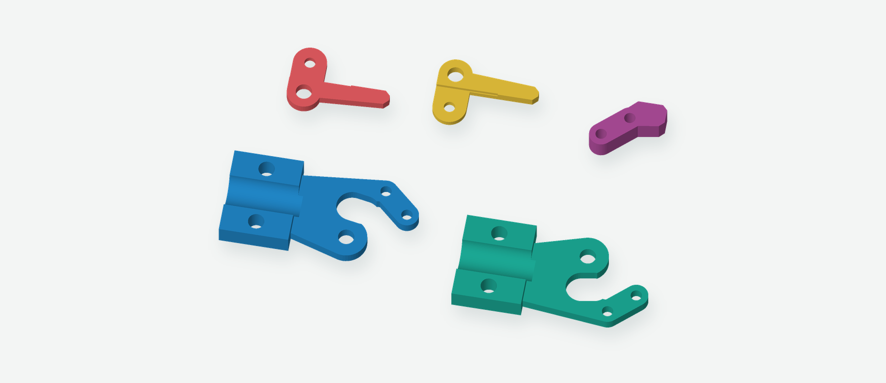
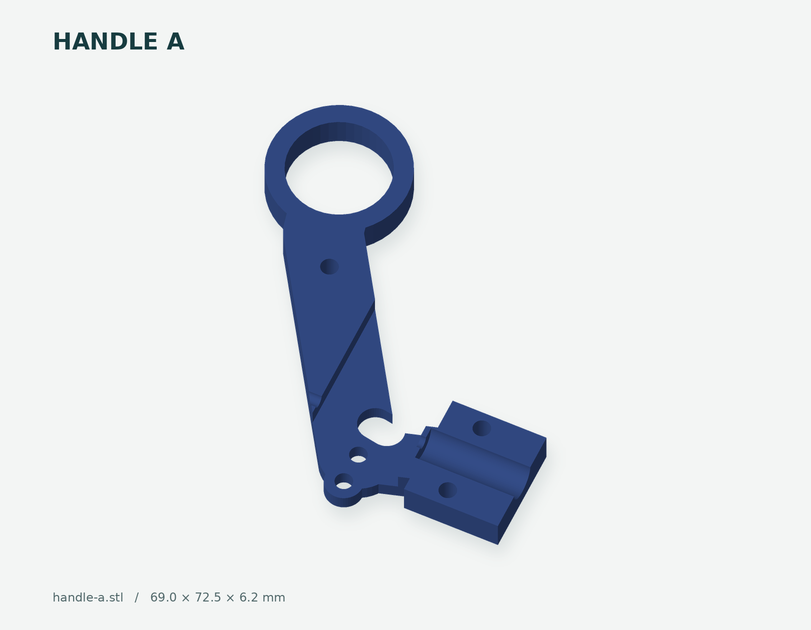
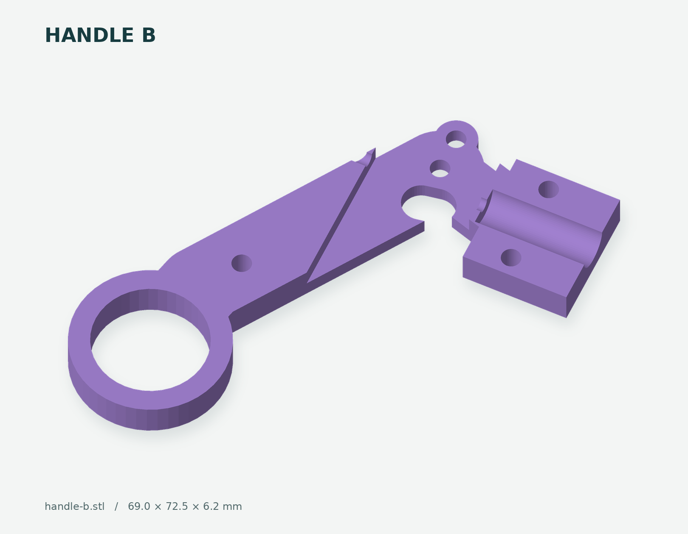
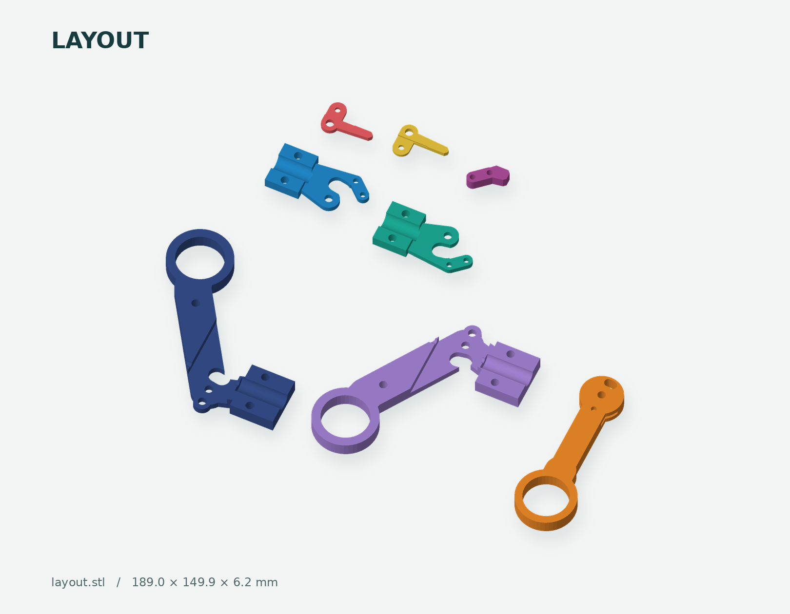
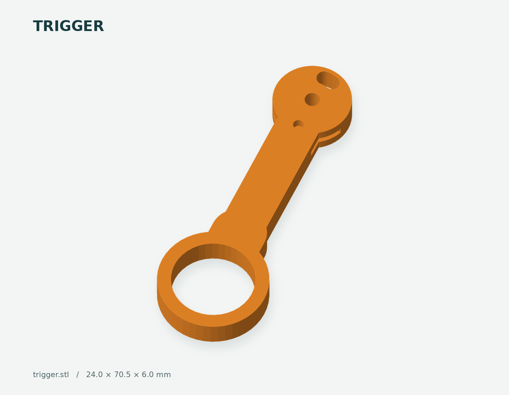

# Precision Grasper v0.2

[](docs/images/assembly.png)

A hand-operated grasper for dexterity practice: squeezing the finger loops pulls a wire through a metal tube and closes the jaw. Spreading the loops pushes the wire and opens it again. Each of the eight printed parts has its own preview color; the metal tube, rod, and fasteners are purchased hardware. The colors identify parts and do not require a multicolor print.

**Build status:** the v0.1 handle parts printed successfully in PLA, as reported by the builder. The original head was too bulky and its thin raised features printed poorly. **v0.2 replaces only the head with five parts designed to print flat without supports.** The new head has passed digital checks and has been sliced, but has not yet been physically printed or tested.

Already printed the handle? Keep it. [Print just the replacement head](prints/fox-build-a1-head-v02/PRINT-GUIDE.md): approximately **34 minutes and 4.49 g of PLA** on a Bambu A1 with a 0.4 mm nozzle and textured PEI plate.

## The head redesign

[](docs/images/head-v02.png)

The old head placed narrow fingers above the bed and relied on supports. This version changes the parts themselves: each cheek has a continuous outer face on the bed, the lower contact tip is a separate flat insert, and the moving jaw splits into two flat halves with upward-facing wire pockets. The tip-mounting screws sit behind the contact surface. Assemble these flat pieces into the head after printing.

| Detail | Original v0.1 | Revised v0.2 |
| --- | --- | --- |
| Closed printed head, excluding fastener protrusions | 45 × 21.5 × 12.4 mm | **43 × 18.34 × 9.4 mm** |
| Printed head material volume | 5,856 mm³ | **3,543 mm³ — about 39.5% less** |
| Head thickness | 12.4 mm | **9.4 mm — about 24% thinner** |
| Head print arrangement | Three parts, raised tips requiring supports | **Five parts, all flat on the bed; supports off** |
| Contact-tip width across the head | About 3 mm | **4 mm moving / 4.6 mm fixed** |
| Handle, tube, and linkage | Original interface | **Unchanged handle; same 116 mm tube and 140 mm rod-eye spacing** |

**Reinforcement refinement:** the triangular opening behind the linkage is now filled with a 2.4 mm thick web in each cheek. Together the webs add approximately **47 mm³** of material. The central rod passage and rounded linkage-fastener access remain clear through the modeled motion. This increases the section connecting the arms to the tube clamp; the strength improvement still needs a physical test.

The contact tips are deliberately a little wider than v0.1 to give filament layers more section to carry load. The surrounding head is slimmer. For substantially smaller metal contact tips, see the [commercial clip option](#could-an-off-the-shelf-alligator-clip-work).

[](head-layout.stl)

Preview colors stay consistent between assembly, layout, and individual-part views:

| Printed part | Preview color |
| --- | --- |
| Nose A | Blue |
| Nose B | Teal |
| Jaw A | Coral |
| Jaw B | Yellow |
| Fixed tip insert | Magenta |
| Handle A | Navy |
| Handle B | Lavender |
| Trigger | Orange |

Print **one each** of `nose-a.stl`, `nose-b.stl`, `jaw-a.stl`, `jaw-b.stl`, and `fixed-jaw.stl`, or use `head-layout.stl`. Do not print both the individual files and the layout. The new moving jaw uses two halves; the old one-piece `jaw.stl` is archived.

[Detailed head assembly and print instructions](docs/HEAD-V02.md) · [Bambu Studio project](prints/fox-build-a1-head-v02/grape-grasper-head-v02-A1-PLA.3mf) · [Sliced G-code](prints/fox-build-a1-head-v02/grape-grasper-head-v02-A1-PLA.gcode)

## Build log

### First PLA print — September 5, 2026

The handle parts printed well and feel solid. The gripper head needs another pass: it was too bulky, and its thin features failed to print cleanly.

| On the printer | Original head close-up |
| --- | --- |
| [](docs/build-log/first-pla-print/on-the-printer.png) | [](docs/build-log/first-pla-print/head-closeup.png) |

The replacement head is smaller and split into five parts that print flat. Reinforcing webs connect the side plates' arms to the tube clamp. The successful handle prints can be reused.

Next up: print the new head, assemble it with the pushrod, and check that the jaws move freely and grip well.

## Could an off-the-shelf alligator clip work?

**Yes, with an adapter.** A useful candidate is the **Mueller BU-34 smooth-jaw micro clip**, or **BU-34X** in stainless steel. The manufacturer's [BU-34 series datasheet](https://www.muellerelectric.com/product_files/229/DS-BU-34.pdf) specifies approximately **27.8 × 5.1 × 7.9 mm**, with up to **5.6 mm jaw spread**. Smooth jaws make this a more relevant starting point than a coarse-toothed electrical clip, though grip on grape skin still needs testing.

| Candidate | Material | Listed single-piece price, checked September 5, 2026 |
| --- | --- | --- |
| [Mueller BU-34 at DigiKey](https://www.digikey.com/en/products/detail/mueller-electric-co/BU-34/304581) | Nickel-plated steel | **$0.66**, before tax/shipping |
| [Mueller BU-34X at DigiKey](https://www.digikey.com/en/products/detail/mueller-electric-co/BU-34X/4766487) | Stainless steel | **$1.17**, before tax/shipping |

A proposed conversion would hold the clip's fixed shank in a printed cradle and put a sliding cam on the pushrod. Advancing the rod would press the clip's rear lever to open it; retracting the rod would release the lever and let the clip spring close. That preserves the current squeeze-to-close direction, but **grip force would come from the clip spring**, rather than direct control through our jaw linkage.

This is an engineering concept, not a validated drop-in adapter. The catalog gives overall dimensions, not the tail/pivot geometry or spring force needed to finish a reliable mount and cam. Measure one sample's mounting shape, lever travel, and opening force, and verify that our **2.39 mm rod stroke** gives sufficient travel. Simply attaching the rod to the solder/crimp tail will not actuate the jaw. A rigid push/pull conversion with controllable closing force would need a separate crank and likely clip modification. The supplied v0.2 files implement the printed head; they do not claim compatibility with an unmeasured clip.

## What is included

- `precision-grasper.js`: editable JSCAD source with full assembly, head close-up, head-only layout, full layout, and individual-part views.
- **Unchanged handle STLs:** `handle-a`, `handle-b`, and `trigger`; existing successful prints can be reused.
- **Five replacement head STLs:** `nose-a`, `nose-b`, `jaw-a`, `jaw-b`, and `fixed-jaw`.
- `head-layout.stl`: just the replacement head, approximately **86.4 × 53.5 mm**.
- `layout.stl`: all eight current parts, approximately **189 × 149.9 mm**.
- `mesh-checks.json`, `motion-checks.json`, and `printability-checks.json`: digital validation results.
- `prints/fox-build-a1-head-v02/`: the replacement-head PLA project, G-code, guide, and toolpath preview.
- `archive/v0.1/`: the complete previous version, retained as a build record.

<!-- STL-GALLERY:START -->
<!-- Generated by scripts/render_stls.py; do not edit this section. -->
## STL previews

For the replacement head, print nose-a, nose-b, jaw-a, jaw-b, and fixed-jaw once each, **or** head-layout. The full layout also includes the three unchanged handle parts. Dimensions are STL bounds; previews are individually scaled.

### Fixed Jaw

[](fixed-jaw.stl)

### Handle A

[](handle-a.stl)

### Handle B

[](handle-b.stl)

### Head Layout

[](head-layout.stl)

### Jaw A

[](jaw-a.stl)

### Jaw B

[](jaw-b.stl)

### Layout

[](layout.stl)

### Nose A

[](nose-a.stl)

### Nose B

[](nose-b.stl)

### Trigger

[](docs/images/assembly.png)

A hand-operated grasper for dexterity practice: squeezing the finger loops pulls a wire through a metal tube and closes the jaw. Spreading the loops pushes the wire and opens it again. Teal and orange components are printed; the metal tube, rod, and fasteners are purchased hardware.

**Build status:** the v0.1 handle parts printed successfully in PLA, as reported by the builder. The original head was too bulky and its thin raised features printed poorly. **v0.2 replaces only the head with five parts designed to print flat without supports.** The new head has passed digital checks and has been sliced, but has not yet been physically printed or tested.

Already printed the handle? Keep it. [Print just the replacement head](prints/fox-build-a1-head-v02/PRINT-GUIDE.md): approximately **34 minutes and 4.43 g of PLA** on a Bambu A1 with a 0.4 mm nozzle and textured PEI plate.

## The head redesign

[](docs/images/head-v02.png)

The old head placed narrow fingers above the bed and relied on supports. This version changes the parts themselves: each cheek has a continuous outer face on the bed, the lower contact tip is a separate flat insert, and the moving jaw splits into two flat halves with upward-facing wire pockets. The tip-mounting screws sit behind the contact surface. Assemble these flat pieces into the head after printing.

Detail
Original v0.1
Revised v0.2

Closed printed head, excluding fastener protrusions
45 × 21.5 × 12.4 mm
**43 × 18.34 × 9.4 mm**
Printed head material volume
5,856 mm³
**3,496 mm³ — about 40% less**
Head thickness
12.4 mm
**9.4 mm — about 24% thinner**
Head print arrangement
Three parts, raised tips requiring supports
**Five parts, all flat on the bed; supports off**
Contact-tip width across the head
About 3 mm
**4 mm moving / 4.6 mm fixed**
Handle, tube, and linkage
Orig](docs/images/assembly.png)

A hand-operated grasper for dexterity practice: squeezing the finger loops pulls a wire through a metal tube and closes the jaw. Spreading the loops pushes the wire and opens it again. Teal and orange components are printed; the metal tube, rod, and fasteners are purchased hardware.

**Build status:** the v0.1 handle parts printed successfully in PLA, as reported by the builder. The original head was too bulky and its thin raised features printed poorly. **v0.2 replaces only the head with five parts designed to print flat without supports.** The new head has passed digital checks and has been sliced, but has not yet been physically printed or tested.

Already printed the handle? Keep it. [Print just the replacement head](prints/fox-build-a1-head-v02/PRINT-GUIDE.md): approximately **34 minutes and 4.43 g of PLA** on a Bambu A1 with a 0.4 mm nozzle and textured PEI plate.

## The head redesign

[](docs/images/head-v02.png)

The old head placed narrow fingers above the bed and relied on supports. This version changes the parts themselves: each cheek has a continuous outer face on the bed, the lower contact tip is a separate flat insert, and the moving jaw splits into two flat halves with upward-facing wire pockets. The tip-mounting screws sit behind the contact surface. Assemble these flat pieces into the head after printing.

Detail
Original v0.1
Revised v0.2

Closed printed head, excluding fastener protrusions
45 × 21.5 × 12.4 mm
**43 × 18.34 × 9.4 mm**
Printed head material volume
5,856 mm³
**3,496 mm³ — about 40% less**
Head thickness
12.4 mm
**9.4 mm — about 24% thinner**
Head print arrangement
Three parts, raised tips requiring supports
**Five parts, all flat on the bed; supports off**
Contact-tip width across the head
About 3 mm
**4 mm moving / 4.6 mm fixed**
Handle, tube, and linkage
Orig](trigger.stl)
<!-- STL-GALLERY:END -->

## Parts to buy or find

Buy **one of each of the three products below**. Their full-pack subtotal was **$20.67** on Amazon on September 5, 2026, excluding tax, any shipping charges, tools, filament, and socket shims. Prices and availability can change; check the selected offer on Amazon before ordering.

Amazon links below are affiliate links. As an Amazon Associate I earn from qualifying purchases.

| Product to buy | Specification and use | Pack price |
| --- | --- | ---: |
| [K&S 8106 round aluminum tube — 1 tube](https://www.amazon.com/dp/B00FZS20P0?tag=rickcarlino-20) | **1/4 inch (6.35 mm) OD × 0.014 inch wall × 12 inches long**. Calculated nominal ID is **5.64 mm**, above the required 4.8 mm. Cut one **116 mm** piece and deburr it. This is the lower-cost aluminum option for the metal shaft. | **$6.19** |
| [K&S 5497 music wire — 4 lengths](https://www.amazon.com/dp/B002WXPNA0?smid=A2E137HZ093DQ5&psc=1&tag=rickcarlino-20) | Select **0.039 inch OD × 12 inches long**, approximately **0.99 mm diameter**. Use about **180 mm** before forming the eyes. This is carbon spring steel for the dry internal linkage, not the contact tips. The quoted offer is from **Hobbylinc**. | **$6.29** |
| [HanTof 900-piece hex socket head cap screw, nut, and washer assortment](https://www.amazon.com/dp/B0FF4RH81S?tag=rickcarlino-20) | Select **900-Pieces Set**, with M2, M2.5, and M3 hardware and black Grade 12.9 alloy-steel cap screws. The listed contents include **25 × M3 × 20 mm**, **25 × M2 × 12 mm**, **100 nuts and 100 flat washers of each size**, plus hex keys. One kit covers all the fasteners below. | **$8.19** |
| **Total: one tube pack + one wire pack + one hardware kit** | Extra wire and fasteners remain for spares and later builds. | **$20.67** |

**Shipping:** The selected Hobbylinc wire offer included free shipping, with an estimated arrival of September 22, 2026. The tube and hardware kit were shipped by Amazon, with free shipping offered through Prime or on qualifying Amazon-shipped orders over $35. Their combined eligible subtotal here is only **$14.38**, so free shipping for those two items is not assumed in the price above. Confirm delivery dates and charges at checkout.
concord grape

### Fasteners used from the kit

| Component | Needed for one grasper | Included in the selected kit |
| --- | --- | --- |
| M3 × 20 mm machine screws | **8**: two pivots, one travel-stop pin, four tube-socket screws, one fixed-grip screw | 25 |
| M3 nuts | **8** | 100 ordinary hex nuts; Nyloc nuts are not included |
| M3 thin flat washers | Approximately **16** | 100 |
| M2 × 12 mm linkage screws | **4**: two linkage screws and two fixed-tip mounting screws | 25 |
| M2 nuts | **4** | 100 |
| M2 thin flat washers | Approximately **8** | 100 |

Use M2 screw heads and nuts under **6 mm across**, and washers no more than **5 mm OD** on the two new fixed-tip screws. M2 × 12 mm fits the 9.4 mm head stack with thin washers and a standard thin nut; verify full nut engagement and use longer M2 screws if your washers/nuts require it. Keep the pivots and linkage joints free to move; do not tighten them until they bind. Nyloc nuts remain an optional alternative for retaining the lightly tightened M3 pivot and stop screws and are not part of this budget cart.[![

### Supplies excluded from the shopping subtotal

- **Socket shims:** a little thin tape or paper. The tube bores are 6.65 mm for print clearance; use shims until the sockets grip the tube without crushing the plastic. These are still needed for assembly even when already on hand.
- **Filament:** allow **30–40 g** including supports. PLA remains the baseline. The replacement head alone is estimated at **4.49 g**, including brims. PETG is an alternative after fit is established.

A 6 mm tube can be used by changing `P.tubeOD` and regenerating the housing meshes; do not scale every part to fit it. The selected 6.35 mm OD tube matches the supplied design without that change.

Tools: small saw or tubing cutter, file/deburring tool, ruler or calipers, two pairs of pliers, hardened-wire cutters, appropriate screwdrivers, and a small drill bit or hand reamer for cleaning holes. Music wire is harder to bend than soft craft wire; practice on an offcut before making the final linkage. A straight 1 mm stainless wire with comparable stiffness is another option, but soft wire may buckle when opening.

## Print setup

Use the [v0.2 head-only print package](prints/fox-build-a1-head-v02/PRINT-GUIDE.md) for this iteration. It is sliced for **Bambu A1, 0.4 mm nozzle, PLA, textured PEI, 0.16 mm layers, four walls, 50% gyroid infill, and 2 mm brims**, with **supports disabled**. Check the printer's nozzle, plate, and filament before using the G-code; select the actual hardware/material and reslice if different.

Every new head part is supplied with its broad continuous face at Z=0. Keep this orientation: the shallow wire pockets and half-round tube seats face upward. Clear brims and any elephant foot from the mating faces. The new jaw is **4.0 mm thick inside a 4.6 mm fork**, with nominal **0.3 mm clearance on each side**. The split crank has a **1.5 mm central wire slot**. Clean the nominal **3.25 mm M3 holes** and **2.25 mm M2 holes** gently by hand until the fasteners slide through.

The unchanged handle parts have already printed successfully for the builder. Retain those prints. The old six-part A1 package includes the rejected head geometry and is superseded for this build.

## Assembly

1. **Keep the existing handle.** The two handle shells and trigger geometry have not changed. For a fresh build, sandwich the trigger between the shells with its M3 pivot, stop pin, fixed-grip screw, and two socket screws. The finger openings remain 19 mm fixed and 18 mm moving.
2. **Prepare the tube and pushrod.** Use the original **6.35 mm OD × 116 mm tube**. Form approximately **2.3 mm ID / 4.3 mm OD eyes** in the 1 mm wire, with their centers **140 mm apart**, in one plane. Thread the tube on before forming the second eye. The straight wire meets the tops of the eyes. Deburr the tube and discard wire that cracks while bending.
3. **Build the split moving jaw.** Face the shallow pockets in Jaw A and Jaw B toward each other, forming the 1.5 mm central slot. Put the rod eye between them and pass an M2 linkage screw through both halves and the eye. Retain the nut loosely enough that the eye can swivel. Both jaw halves also share the M3 pivot hole, which aligns them during final assembly.
4. **Install the fixed tip.** Sandwich `fixed-jaw` between Nose A and Nose B with its flat gripping face toward the moving jaw. Its two staggered holes line up with the two small holes in each cheek's lower arm. Secure with **two M2 × 12 mm screws, two nuts, and four thin washers**, using washers no more than 5 mm OD. Check full nut engagement; use longer M2 screws if the actual washer/nut stack needs them. The insert establishes the 4.6 mm cheek spacing at the front.
5. **Install the moving jaw and tube.** Put the split jaw between the cheeks and install its original M3 × 20 mm pivot with washers and nut. Fit the tube into the rear half-round seats and loosely install the two M3 socket screws. Leave the jaw and wire eye free to move; do not clamp them until they bind.
6. **Set alignment.** With the jaws closed, place the handle and head main pivot centers **140 mm apart** in the same plane. Each tube end is 12 mm toward the shaft from its corresponding pivot. The revised head seat spans approximately 13 mm of the tube; the handle seat remains approximately 17 mm. The tube itself does not need recutting.
7. **Secure and cycle.** Use thin shims in the 6.65 mm socket bores as needed to retain the tube without crushing the plastic. Close gently and check that the contact faces meet. Cycle slowly at least 20 times, checking rod alignment, freely moving joints, and tip alignment. Begin with a paper strip or small lightweight object. This step is the pending physical validation of v0.2.

## Motion and checks

The original **7 mm cranks**, **140 mm pivot spacing**, and **140 mm eye spacing** remain a parallelogram linkage. At 20 degrees, calculated rod travel is **2.39 mm**, the opening at the 16 mm tip station is **5.65 mm**, and finger-loop motion is approximately **17.1 mm**.

The updated checks found no modeled intersections between frame and moving parts, rod and printed parts, tube and printed parts, or a 6 mm diameter head-link fastener envelope and the frame at each whole degree from 0 through 20. The five individual head meshes are single watertight solids. Both layouts are collision-free. In their supplied print orientations, the new head meshes have flat bed faces and no raised horizontal undersides. The sliced plate contains all five parts and no support extrusion; minor internal bridge paths over infill are separate from the unsupported fingers in v0.1.

These checks do not establish strength, wear, actual printer clearances, or gripping performance. The handle print success is builder feedback, not a full mechanism test. Hardware in the assembly view is simplified; the next physical fit test remains necessary.

## Contact surfaces and cleaning

Use the next print for fit checks and gentle gripping practice. Remove rough edges and trapped debris, and clean and dry the removable tip and linkage after use. Replace cracked tips. The replaceable flat fixed insert makes later tip experiments inexpensive.

## Rebuild the screenshots

The gallery previews use the supplied current STL meshes; the assembly views use the JSCAD model. The following commands regenerate the STL gallery only, leaving the assembly images and build photos intact. Python 3.10+ and Make are required; no browser or GPU is needed.

```sh
make setup
make screenshots PYTHON=.venv/bin/python
```

Use `make screenshots-force PYTHON=.venv/bin/python` to force an STL-preview rebuild. The renderer discovers only current STLs in the project root, so archived failed parts do not reappear in the current gallery. Content inside `STL-GALLERY` markers is generated. This command does not regenerate STL geometry from JSCAD.
