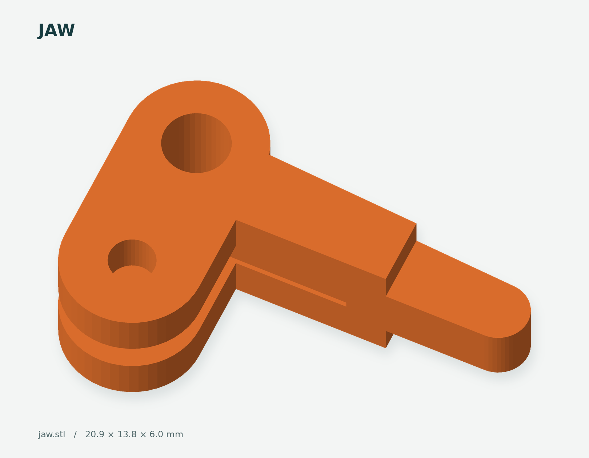
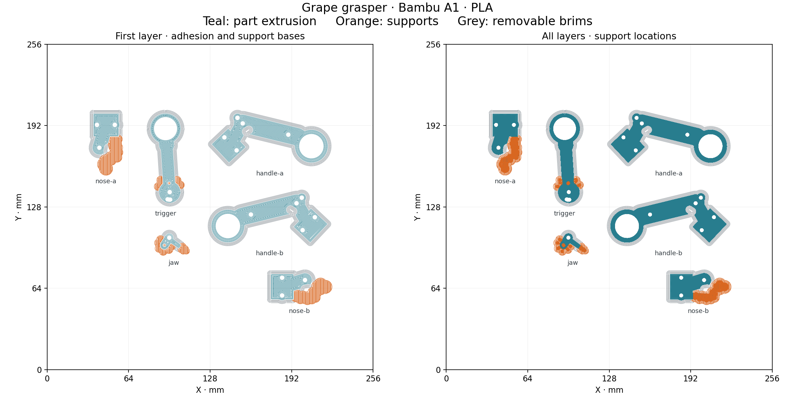

# Grape Grasper v0.1

[](docs/images/assembly.png)

*Full CAD assembly with the jaws open. Teal and orange parts are 3D printed; the metal shaft and fasteners are purchased hardware.*

A short, manually operated grasper for dexterity and precision-gripping experiments. Squeezing the finger loops pulls a wire through a metal tube and closes the upper jaw. Spreading the loops pushes the wire and opens it again. No motor, cable housing, tiny return spring, or electrical alligator clip is required.

**Status:** modeled and checked digitally; not yet printed or physically tested. This is a first bench prototype. The main uncertainties are print fit, wire-eye fabrication, joint friction, and how reliably the blunt tips grip small objects.

## What is included

- `precision-grasper.js`: editable JSCAD source, with assembly, individual-part, and print-layout views. The opening slider moves the grip and jaw together.
- Six individual STLs: `handle-a`, `handle-b`, `nose-a`, `nose-b`, `trigger`, and `jaw`. Print **one of each**. A and B are mirrored partners, not duplicates.
- `layout.stl`: all six printed parts arranged separately, approximately **195 × 111 mm**, with their lowest points at Z=0. Center it on your slicer's bed; do not also print the individual files.
- `mesh-checks.json` and `motion-checks.json`: digital verification results.
- [Fox.Build A1 print package](prints/fox-build-a1/PRINT-GUIDE.md): sliced PLA project, microSD G-code, toolpath previews, and setup instructions.

The grey tube and pins and gold pushrod in the assembly view are purchased hardware. They are excluded from the supplied STLs. Use the supplied STLs for the first print; their coincident triangle edges have been stitched and checked. Direct JSCAD re-exports may need the same mesh cleanup after edits.

<!-- STL-GALLERY:START -->
<!-- Generated by scripts/render_stls.py; do not edit this section. -->
## STL previews

Print one of each individual part, **or** the combined layout. Dimensions are the STL bounds; previews are individually scaled.

### Handle A

[](handle-a.stl)

### Handle B

[](handle-b.stl)

### Jaw

[](jaw.stl)

### Layout

[](layout.stl)

### Nose A

[](nose-a.stl)

### Nose B

[](nose-b.stl)

### Trigger

[](trigger.stl)
<!-- STL-GALLERY:END -->

## Parts to buy or find

Buy **one of each of the three products below**. Their full-pack subtotal was **$20.67** on Amazon on September 5, 2026, excluding tax, any shipping charges, tools, filament, and socket shims. Prices and availability can change; check the selected offer on Amazon before ordering.

Amazon links below are affiliate links. As an Amazon Associate I earn from qualifying purchases.

| Product to buy | Specification and use | Pack price |
|---|---|---:|
| [K&S 8106 round aluminum tube — 1 tube](https://www.amazon.com/dp/B00FZS20P0?tag=rickcarlino-20) | **1/4 inch (6.35 mm) OD × 0.014 inch wall × 12 inches long**. Calculated nominal ID is **5.64 mm**, above the required 4.8 mm. Cut one **116 mm** piece and deburr it. This is the lower-cost aluminum option for the metal shaft. | **$6.19** |
| [K&S 5497 music wire — 4 lengths](https://www.amazon.com/dp/B002WXPNA0?smid=A2E137HZ093DQ5&psc=1&tag=rickcarlino-20) | Select **0.039 inch OD × 12 inches long**, approximately **0.99 mm diameter**. Use about **180 mm** before forming the eyes. This is carbon spring steel for the dry internal linkage, not the contact tips. The quoted offer is from **Hobbylinc**. | **$6.29** |
| [HanTof 900-piece hex socket head cap screw, nut, and washer assortment](https://www.amazon.com/dp/B0FF4RH81S?tag=rickcarlino-20) | Select **900-Pieces Set**, with M2, M2.5, and M3 hardware and black Grade 12.9 alloy-steel cap screws. The listed contents include **25 × M3 × 20 mm**, **25 × M2 × 12 mm**, **100 nuts and 100 flat washers of each size**, plus hex keys. One kit covers all the fasteners below. | **$8.19** |
| **Total: one tube pack + one wire pack + one hardware kit** | Extra wire and fasteners remain for spares and later builds. | **$20.67** |

**Shipping:** The selected Hobbylinc wire offer included free shipping, with an estimated arrival of September 22, 2026. The tube and hardware kit were shipped by Amazon, with free shipping offered through Prime or on qualifying Amazon-shipped orders over $35. Their combined eligible subtotal here is only **$14.38**, so free shipping for those two items is not assumed in the price above. Confirm delivery dates and charges at checkout.
concord grape
### Fasteners used from the kit

| Component | Needed for one grasper | Included in the selected kit |
|---|---|---|
| M3 × 20 mm machine screws | **8**: two pivots, one travel-stop pin, four tube-socket screws, one fixed-grip screw | 25 |
| M3 nuts | **8** | 100 ordinary hex nuts; Nyloc nuts are not included |
| M3 thin flat washers | Approximately **16** | 100 |
| M2 × 12 mm linkage screws | **2**, through the bent wire eyes and small forked cranks | 25 |
| M2 nuts | **2** | 100 |
| M2 thin flat washers | Approximately **4** | 100 |

Use M2 screw heads and nuts under **6 mm across**. Keep the pivots and linkage joints free to move; do not tighten them until they bind. Nyloc nuts remain an optional alternative for retaining the lightly tightened M3 pivot and stop screws and are not part of this budget cart.

### Supplies excluded from the shopping subtotal

- **Socket shims:** a little thin tape or paper. The tube bores are 6.65 mm for print clearance; use shims until the sockets grip the tube without crushing the plastic. These are still needed for assembly even when already on hand.
- **Filament:** allow **30–40 g** including supports. PLA for the first fit test; PETG is an alternative after fit is established.

A 6 mm tube can be used by changing `P.tubeOD` and regenerating the housing meshes; do not scale every part to fit it. The selected 6.35 mm OD tube matches the supplied design without that change.

Tools: small saw or tubing cutter, file/deburring tool, ruler or calipers, two pairs of pliers, hardened-wire cutters, appropriate screwdrivers, and a small drill bit or hand reamer for cleaning holes. Music wire is harder to bend than soft craft wire; practice on an offcut before making the final linkage. A straight 1 mm stainless wire with comparable stiffness is another option, but soft wire may buckle when opening.

## Print setup

### Prepared plate for Fox.Build

The six individual parts are already sliced together for a **Bambu A1, 0.4 mm nozzle, ordinary PLA, and textured PEI plate**. Estimated print: **1 hour 59 minutes and 27.04 g of PLA**, including supports and brims. Settings: 0.16 mm layers, four walls, 50% gyroid infill, tree supports from the bed, and 3 mm brims. Toolpaths have been checked; physical fit still needs the first print.

- [Open the Bambu Studio project](prints/fox-build-a1/grape-grasper-A1-PLA.3mf) as a project to retain all six parts and the saved settings.
- [Download the sliced G-code](prints/fox-build-a1/grape-grasper-A1-PLA.gcode) for microSD printing with the matching setup.
- [Read the makerspace print guide](prints/fox-build-a1/PRINT-GUIDE.md) for setup, support removal, and fit checks.

Confirm the actual nozzle, plate, and loaded material at Fox.Build. If they differ, update those settings in the project and slice again. After CAD or STL changes, regenerate the slice before printing.

[](prints/fox-build-a1/toolpath-preview.png)

[Detailed support preview](prints/fox-build-a1/support-details.png) · [Slice checks and source hashes](prints/fox-build-a1/slice-checks.json)

### General print and fit guidance

Start with a **0.4 mm nozzle, 0.16–0.20 mm layers, four perimeters, and 40–60% infill**. These are proposed starting settings, not tested printer profiles. Use solid local infill around the jaw and pivot holes if available.

The files are oriented with broad faces toward the bed. The narrow jaw tip and the lower fingers on both nose halves have overhangs: **add local supports under these areas**. Inspect the slicer preview around the 1.5 mm wire slots; keep them open and remove any support or stringing afterward. This is not a support-free design.

The fixed grip opening is 19 mm diameter and the moving loop is 18 mm. Check those against your fingers before printing everything. Deburr the finger loops. Clean the nominal 3.25 mm pivot holes and 2.25 mm linkage holes until the screws slide freely. The moving parts are 6 mm thick inside a 6.4 mm fork, providing 0.2 mm nominal clearance per side. Light sanding may be required.

## Assembly

1. **Prepare the tube.** Cut it to 116 mm and deburr both inside and outside edges so they cannot scrape the wire.
2. **Form the pushrod.** Make a small eye in each end of the 1 mm wire, approximately 2.3 mm inside diameter and 4.3 mm outside diameter. Both eyes lie in the same plane and below the straight wire: the straight section meets the top of each eye. Set their centres **140 mm apart**. Thread the tube onto the wire before forming the second eye. Leave no loose sharp tail; discard any wire that cracks during bending.
3. **Attach the moving pieces.** Place one eye in the trigger's 1.5 mm central fork slot, and the other in the moving jaw's slot. Install the M2 screws through the 2.25 mm holes. Tighten the nuts enough to retain the joints while letting the eyes swivel freely; squeezing the fork cheeks onto the wire will jam it.
4. **Assemble the nose.** Put the moving jaw between Nose A and Nose B. The narrow upper tip faces the stationary lower tip. Install its M3 pivot. The large window below the pivot gives access to the M2 linkage screw. Fit the two nose socket screws loosely.
5. **Assemble the handle.** Sandwich the trigger between Handle A and Handle B. Install the M3 pivot, the second M3 screw through the curved travel-stop slot above it, the fixed-grip screw, and the two socket screws. Pivot and stop nuts should retain the parts without pinching the trigger.
6. **Align the tube and housings.** With both mechanisms closed, set the main pivot centres 140 mm apart. Each tube end is then 12 mm toward the shaft from its corresponding pivot. The tube sits approximately 17 mm into the handle socket and 15 mm into the nose socket, leaving about 84 mm exposed between housings. Keep the grip and jaw in the same plane.
7. **Secure the tube.** Add thin shims at the two sockets until the tube cannot rotate or slide under light hand force. Snug the four socket screws. The housings have clearance bores, not interference-fit clamps; the shims are part of this prototype's retention method.
8. **Set the jaw contact.** Close gently. Both tips should meet before any serious load develops. If they do not, adjust the eye spacing or housing position slightly and re-secure the tube. Do not use finger force to compensate for a badly adjusted rod.
9. **Cycle before gripping.** Open and close slowly at least 20 times. Confirm the wire does not bow, catch at a socket, or scrape a screw. Test gripping a thin paper strip, then practice picking up and placing small lightweight objects. Apply gentle pressure and check that the tips hold securely without damaging the object.

The stock eye length is set by bending, not by a threaded adjuster. A threaded RC linkage can be added in a later revision if repeated fine adjustment is needed.

## Motion and fit

The two cranks have the same 7 mm radius. With the pivots and rod-eye centres both spaced 140 mm apart, the linkage is a parallelogram: the trigger and jaw rotate together.

At 20 degrees, the calculated wire travel is **2.39 mm**, the opening at the 16 mm tip station is **5.65 mm**, and the finger-loop centre moves about **17.1 mm** sideways. The tip contact width is approximately 3 mm. The grip's curved slot limits nominal rotation to 0–20 degrees; fastener clearance adds a little play. This mechanism multiplies hand force, so squeeze lightly.

Digital checks found zero modeled intersections between the moving parts and frames, or between the rod/tube and printed parts, at each whole degree from 0 through 20. The six parts do not overlap in the print layout. Every supplied individual STL is one watertight, consistently wound solid; the layout contains six. Small coincident-edge corrections during export changed part volumes by less than 0.003 mm³ each. These checks do not establish strength, wear, tolerances on your printer, or physical gripping performance. Screw heads, washers, nuts, and the bent-wire cross section are simplified in the assembly display.

## Contact surfaces and cleaning

Use the first print for fit checks and gripping practice with paper strips or small lightweight objects. Inspect the contact surfaces for rough edges and trapped debris before each session. Removable metal or silicone tips could be explored in a later revision; alternative tip materials and attachments have not been validated in v0.1.

After a practice session, remove the nose screws and jaw, clean out residue, and dry all parts and the internal wire. Replace cracked or rough tips rather than sharpening them into teeth. The removable nose is intended to make tip experiments inexpensive.

## Rebuild the screenshots

The individual-part and layout PNG previews are rendered directly from the supplied STL meshes with orthographic projection, directional lighting, and consistent part colors. The image at the top uses the full JSCAD assembly, including the purchased hardware. The commands below rebuild the STL gallery. Python 3.10+ and Make are required; rendering is headless and needs no browser, GPU, or CAD application.

```sh
make setup
make screenshots PYTHON=.venv/bin/python
```

The default `make` target also builds screenshots. If NumPy and Pillow are already installed, run `make` directly. Use `make screenshots-force PYTHON=.venv/bin/python` to regenerate every STL preview.

The build discovers all `.stl` files recursively (case insensitive, excluding hidden directories), writes previews to `docs/images/`, and refreshes the gallery in this README. Unchanged meshes reuse their images; changes to the renderer rebuild all previews. Keep the generated PNGs with the README so the guide works without running the build. Edit instructions outside the `STL-GALLERY` markers; content inside them is generated. This target renders the existing STLs; it does not regenerate meshes from JSCAD.
