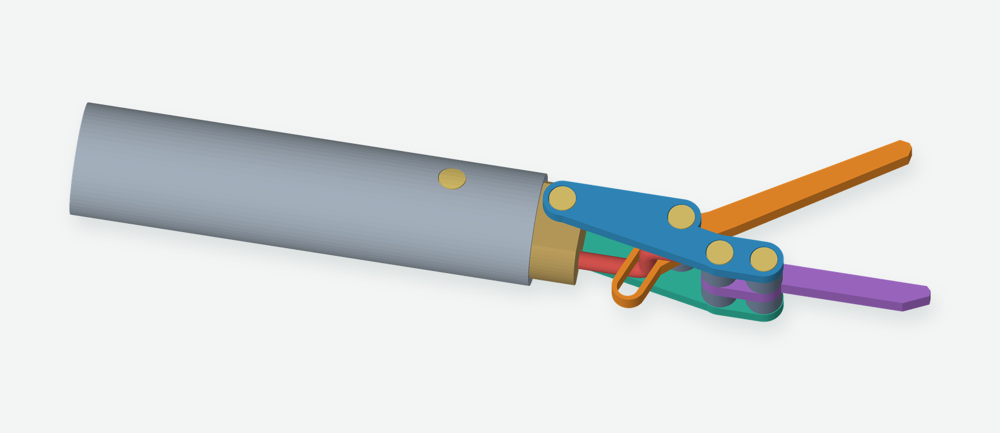
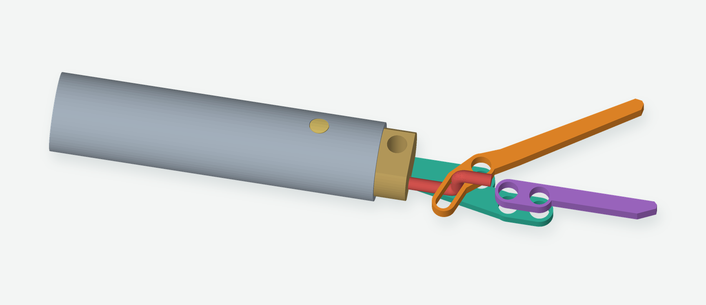

# Compact metal gripper head — v0.3 concept

A metal replacement for the printed nose. Two 0.8 mm side plates support a 1 mm moving jaw and a 1 mm fixed jaw. A small metal insert transfers the load into the existing tube. The colors identify parts; all head structure shown here is metal.

**Status: parked for later.** Work is continuing with the assembled v0.2 printed gripper. These metal-head plans are preserved as a dimensional motion model, not a proven build. The closed geometry occupies a 6.90 mm circular envelope around the shaft axis. An 8 mm hole is the proposed first fit check. The wire bend and flush pin retention still need bench trials before this becomes a fabrication release.

## Inspect it in JSCAD

Open [JSCAD](https://jscad.app/) and paste or load `metal-head.js`. The view selector provides the assembled head, an exposed mechanism, an exploded view, a closed head beside an 8 mm hole gauge, flat sheet parts, individual parts, and a full 116 mm shaft.

Move **Jaw opening** from 0 to 35 degrees. The jaw and wire follow the same geometric constraint in every view. The mechanism view hides the front side plate, its pins and the spacers so the drive slot is visible.

## How it works

The front end of the 1 mm pushrod has a Z bend. Its straight transverse section passes through a 1.2 mm wide slot in the moving jaw. Pulling the rod rotates the jaw closed; pushing it opens the jaw. The return bend captures the jaw between the two parallel portions of the wire.

The slot is straight and can be drilled at its ends and carefully filed between them. It is angled to turn the existing handle's nominal **2.394 mm rod travel into 35 degrees of jaw rotation**. The resulting opening at the working end is about 7.6 mm. The model retains direct push/pull control; it does not use an alligator clip's spring.

The required wire stroke matches the current handle, but the wire's end shape, offset and finished length change. This model checks the head and its required travel. It does not model or certify the revised connection through the complete handle assembly.

## Nominal dimensions and stock

| Item | Modeled size | Quantity |
| --- | --- | --- |
| Existing shaft | 6.35 mm OD, assumed 5.64 mm ID; 116 mm long | 1 |
| Side plates | 0.80 mm sheet; each about 13.95 × 4.05 mm | 2 |
| Moving jaw | 1.00 mm sheet; about 18.95 × 3.65 mm | 1 |
| Fixed jaw | 1.00 mm sheet; about 12.85 × 2.10 mm | 1 |
| Tube insert | 5.50 mm OD × 11.50 mm long; 9 mm enters tube | 1 |
| Insert flats | 3.80 mm across the two faces on the nose | 2 faces |
| Pin holes / pins | 1.60 mm holes / 1.50 mm pins | 5 pins |
| Fixed-jaw spacers | 2.10 mm OD, 1.60 mm bore, 1.40 mm long | 4 |
| Pivot spacers | 2.10 mm OD, 1.60 mm bore, 1.30 mm long | 2 |
| Wire passage in insert | 1.20 mm diameter; offset Y −0.80, Z −1.30 mm | 1 |
| Drive slot | 1.20 mm wide; see template for angle and endpoints | 1 |

The exposed nose extends approximately **22.3 mm beyond the tube end**. The insert is partly inside the tube. Both gripping faces are 1 mm wide and nominally meet when closed.

Brass sheet is a reasonable material for a first mechanism trial; use stainless for the finished contact jaws if the geometry works. Spacer dimensions are fit envelopes, not verified catalog part numbers. Thin tubing may be usable after checking its actual bore and outside diameter. Measure the real tube and sheet before adapting the source parameters.

## Making a trial

Use `sheet-templates.svg` for the four flat profiles. It is a 1:1 drawing with a 20 mm calibration line; print at 100% and measure that line. The profiles are projected from the actual CAD solids, including their holes and slot. Allow for tool kerf and file to size.

The insert can be drilled from round stock and its two nose flats filed. Its tube-retaining cross-pin sits 5 mm behind the tube end. The other cross-pin holds the two side plates to the exposed insert. The fixed jaw is secured between the plates with two pins and four spacers. The moving jaw has one pivot with 0.10 mm axial clearance to each spacer.

The **tight Z bend is the main fabrication uncertainty**: its modeled centerline bend radius is 0.70 mm in 1 mm wire. Trial-bend the actual supplied wire and check for cracking and springback. The captured bend may need to be formed with the jaw on the wire, before installing the side plates. A larger bend will require more clearance and a revised model.

The displayed pins have flush finished ends to show the intended clearance envelope. They still need a retention method. Soft brass pins could be riveted for the prototype, with the end shape and riveting allowance worked out on a sample. Do not assume a cut steel dowel will stay in place, or clamp the moving jaw tightly while riveting. Actual retained fasteners must be included in the hole-fit trial.

## Files and checks

- `metal-head.js`: self-contained JSCAD source; dimensions are in `M` near the top.
- `sheet-templates.svg`: 1:1 profiles for the four sheet parts.
- `stl/`: five solid inspection models, including the insert. These are metal-part references, not a sliced PLA print package.
- `checks.json`: no modeled collisions at 36 samples from 0 to 35 degrees; slot constraint and stroke checked against the handle's nominal travel.
- `stl/mesh-checks.json`: all five exported meshes have one body, consistent winding and closed surfaces.
- `template-checks.json`: projected profile area × thickness agrees with each solid's volume to within 0.001 mm³.

The checks cover nominal geometry. They do not establish grip force, friction, wear, wire fatigue, manufacturing tolerance or assembled pin retention. The current printed v2 head and its print files remain in the repository.
