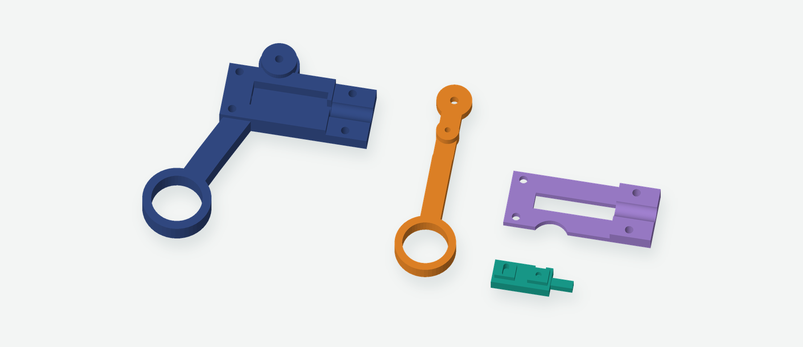
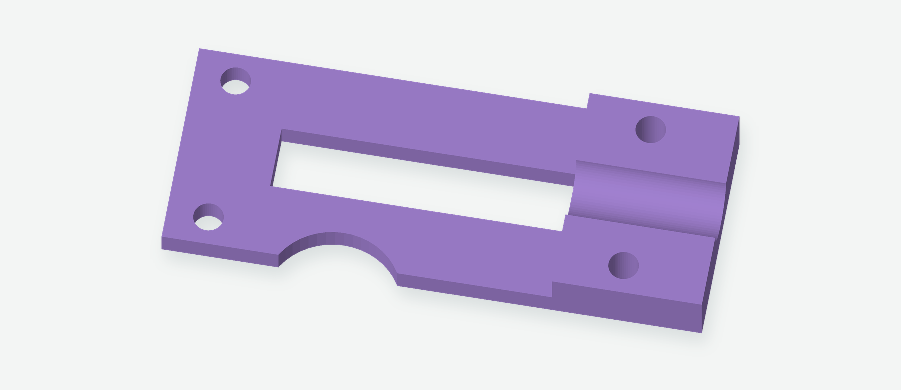

# Guided-wire lever handle — 6 mm travel


**Cover corrected September 9, 2026.** The earlier printable cover was accidentally mirrored, so its circular relief landed on the wrong side when fitted. If you already printed the 6 mm handle, print only the [replacement cover](bambu/guided-wire-cover-corrected-A1-PLA.3mf): **30 min, 4.83 g PLA**. The frame, lever, and carriage STLs are unchanged.

For a new handle, print all four parts below. This revision provides the measured 6 mm wire movement of the assembled v2 head and reuses the existing head, 116 mm metal tube, wire, and hardware.

[6 mm Bambu A1 project](bambu/guided-wire-handle-A1-PLA.3mf) · [JSCAD source](guided-wire-grasper.js) · [Four-part STL layout](stl/layout.stl)

The handle has been printed; fitting exposed the reversed cover. **The corrected cover is digitally checked and sliced, but has not yet been printed.**

## What changed


- **6.0 mm working wire travel**, with 6.4 mm between mechanical stops. The 0.2 mm margin at each end leaves room for adjustment.
- **About 4.3:1 leverage** from the 65 mm finger arm and 15 mm drive arm. The finger ring moves approximately 26 mm for the working stroke, plus reversal play.
- **A telescoping wire guide:** the green carriage has a 3.4 mm square nose that slides inside the metal tube. Its overlap is 0.6–6.6 mm during the working stroke, so there is no bare-wire gap between the carriage guide and tube. Overlap remains 0.4 mm at the rear hard stop.
- **A straight through-hole:** wire passes through the carriage and exits the rear of the frame. Excess wire can protrude while you adjust it. The drive screw ends above this passage and cannot obstruct it in the modeled motion.


The M2 drive screw is fastened into a nut in the orange lever. Its tip engages the carriage slot by 3.5 mm, with 0.5 mm clearance above the slot floor and 1.8 mm above the wire. A separate M2 screw clamps the wire in the carriage. No handle-end loop is needed.

The 2 mm drive screw runs in a 2.3 mm-wide slot: nominal reversal play is 0.3 mm at the wire, or about 1.3 mm at the finger ring. The stops limit travel, not gripping force.

In JSCAD, select **6 mm guided-wire handle** or **Cover removed**, then move **Wire advance (mm)** from 0 to 6. The full assembly view is a closed reference. The builder's measured travel sets the handle stroke; the old head CAD does not establish the as-built relationship between wire travel and jaw angle.

## Print at FOX.BUILD

Open [guided-wire-handle-A1-PLA.3mf](bambu/guided-wire-handle-A1-PLA.3mf) **as a project** in Bambu Studio. This file contains the revised four models, settings, and freshly sliced G-code. Its process profile is **Grasper 6mm cover rotation fix 2026-09-09 - A1 PLA**. The [cover-only project](bambu/guided-wire-cover-corrected-A1-PLA.3mf) uses the same settings and contains just the replacement part. Earlier downloaded projects with the old profile still contain the mirrored cover; download the corrected file again.

- Bambu A1, **0.4 mm nozzle**, Generic PLA, textured PEI plate.
- 0.16 mm layers; 0.20 mm first layer; five walls; 60% gyroid; 2 mm brims; supports off.
- Estimate: **2 hr 15 min, 28.55 g PLA**. Confirm the installed nozzle and filament.
- Keep the supplied orientations. Frame, lever, and carriage print flat; the cover prints upside down using a 180° rotation about its length, preserving its handedness. Fit it with the tube saddle facing down and the circular relief beside the lever pivot. The carriage's narrow guide starts on the same bed plane as its body.
- Clean the small wire holes and nut pockets after printing. They contain short bridges. Leave timelapse off. The headless project has no native thumbnail; reslicing in Bambu Studio generates its preview.





The cover above is shown as printed. Turn it over during assembly: the saddle faces the tube and the circular relief clears the lever pivot. [Cover-only toolpaths](bambu/cover-toolpath-preview.png) · [Cover-only slice checks](bambu/cover-slice-checks.json).

Individual STLs: [frame](stl/frame.stl), [lever](stl/lever.stl), [carriage](stl/carriage.stl), [cover](stl/cover.stl). [Verified toolpath preview](bambu/toolpath-preview.png).

## Hardware for this handle

| Hardware | Quantity | Use |
| --- | ---: | --- |
| M3 × 20 mm screws and M3 nuts | 5 each | Four cover screws and lever pivot |
| M3 flat washers | 10 | Two at each cover screw; one above and one below the lever |
| M2 × 12 mm screws and M2 nuts | 2 each | Wire clamp and lever drive pin |

The washer below the lever is **0.5 mm thick, 7 mm OD**. The other modeled M3 washers are also 0.5 mm thick. The pivot nut sits inside the underside of the frame without an outside bottom washer. M2 nuts are nominally 4 mm across flats × 1.6 mm thick. No extra purchased parts are needed.

## Assembly and adjustment

1. Remove brims. Clean the carriage rails, nut pockets, and wire passage. With the clamp screw backed out, pass a straight piece of the actual wire completely through the carriage. Also check the 1.5 mm rear frame hole. Do not drill into the drive-slot floor above the wire passage.
2. Check that the carriage's square nose slides freely into the deburred tube. It has approximately 0.42 mm clearance at its corners in the nominal 5.64 mm tube bore. Remove print burrs if needed; do not force it.
3. Insert an M2 nut into the side of the lever's drive boss and another into the carriage. Seat the lever's M2 × 12 screw fully against its raised boss. Start the carriage clamp screw but leave its wire passage open.
4. Seat the M3 pivot nut in the frame's underside pocket. Lower the carriage into the open frame **before inserting the tube**. Slide the tube over the projecting guide until it reaches the shoulder. Feed the straight wire end from the tube, through the carriage, and out the rear frame hole. Keep the existing head-end attachment.
5. Turn the cover over so its tube saddle faces down and its circular relief clears the frame’s raised lever-pivot boss. Fit it with four M3 screws, nuts, and outside washers. Tighten evenly and check that the carriage slides freely. Nominal clearance is 0.25 mm at each side and 0.35 mm beneath the cover. If the tube slips after the clamp faces meet, use a thin paper or tape wrap at the socket instead of tightening harder.
6. Put the 0.5 mm washer on the pivot boss. Fit the lever with its drive screw in the carriage slot, then add the top washer and M3 screw. **Adjust the pivot for free rotation. Fully tightening it can bind the lever; this is not a shoulder-bolt joint.**
7. Close the actual jaws gently. Position the carriage about **0.2 mm forward of its rear stop**, then tighten the wire clamp gently. Leave the excess wire sticking out of the back while fitting; there is no prescribed tail length and no need to pull a loop through the handle.
8. Mark the wire at the rear exit and measure 6 mm of advance while opening the lever. Check that the head reaches its intended opening and returns without wire slip or rubbing. If the head stops first, release the lever and adjust the wire; do not force the mechanical stops against a closed jaw. Trim the free tail later only if desired.

## Checks and limitations

[Handle motion checks](checks.json) passed at **122 positions**, covering the full 0–6 mm stroke in both pushing and pulling contact states. Additional checks cover the wire exit, screw and nut insertion, carriage drop-in, tube insertion, drive contact, and mechanical stops.

[Mesh and layer checks](mesh-checks.json) passed for four single-body watertight parts with no floating layer islands. The saved cover STL is now turned back into assembly position using only a rotation and translation, checked against the intended shape, and checked for frame overlap. A deliberately mirrored cover must fail the same fit check. [Bambu checks](bambu/slice-checks.json) verify matching embedded meshes, settings, first-layer paths for all parts, bed bounds, and the G-code checksum.

The [orientation audit](../../orientation-checks.json) checked all nine current parts against the intended assembly using rotations and translations, and checked the saved Bambu models against their STLs. No other reversed parts were found. The head’s paired mirrored halves are intentional.

The existing head geometry is unchanged. Its old idealized linkage model shows small overlaps when extrapolated beyond its original range; it does not supersede the builder's measured 6 mm travel. The assembly image therefore shows the closed head, and the motion slider demonstrates the new handle independently. Check the assembled head for rubbing during the first slow cycles.

The corrected cover still needs a physical fit test, and the complete handle needs a grip test. Digital checks do not prove friction, clamp force, fatigue, or buckling resistance. The large tube bore can still allow internal wire bowing, although the telescoping nose supports the transition at the handle.

To rebuild from the repository root:

```sh
node designs/guided-wire-handle/check.cjs
node designs/guided-wire-handle/export.cjs work/guided-wire
python designs/guided-wire-handle/build.py work/guided-wire
python designs/guided-wire-handle/render.py work/guided-wire
python scripts/verify_bambu.py designs/guided-wire-handle/bambu/guided-wire-handle-A1-PLA.3mf guided --source-dir designs/guided-wire-handle/stl --output-dir work/guided-wire/verified
python scripts/verify_bambu.py designs/guided-wire-handle/bambu/guided-wire-cover-corrected-A1-PLA.3mf cover --source-dir designs/guided-wire-handle/stl --output-dir work/guided-wire/cover-verified
```

Use the existing Node and Python check/render dependencies. The [saved Bambu profiles](bambu/profiles) belong to this revision. Rebuilding STLs does not reslice the project automatically.
