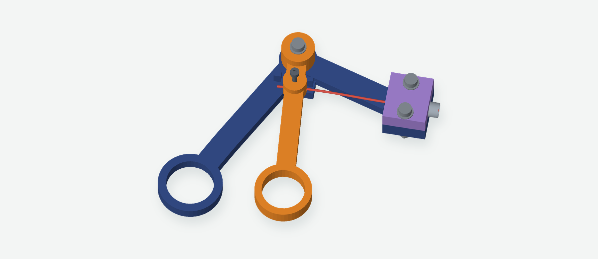
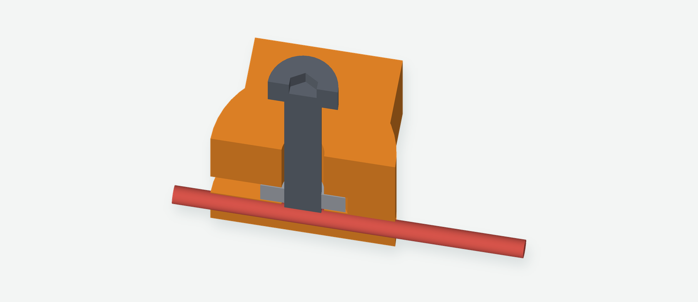

# Direct-clamp lever handle

**Previous design:** the [guided-wire handle](../designs/guided-wire-handle/README.md) replaces the long exposed wire span with a lever-driven carriage and fixed guide. These files remain as a reference.

The handle has three printed parts: a fixed grip, a squeeze lever, and a tube cap. An M2 screw presses directly onto the straight wire inside the lever. A captive metal nut supplies the threads. The lever pulls the wire when squeezed and pushes it when opened.

The finger ring is 65 mm from the pivot and the wire is 15 mm from it: **about 4.3:1 nominal leverage**. Roughly 10.4 mm of finger travel produces 2.39 mm of rod travel. The lever rotates only 9.15° while the existing v2 jaw rotates 20°.

## Print and hardware

Print [the three-part A1 project](../prints/fox-build-a1-lever/grape-grasper-lever-A1-PLA.3mf), or one each of [fixed-grip.stl](../fixed-grip.stl), [squeeze-lever.stl](../squeeze-lever.stl), and [tube-cap.stl](../tube-cap.stl). The supplied STLs have their broad faces on the bed. The cap's tube groove faces up in the print and down in the assembly.

| Hardware for this handle | Quantity | Location |
| --- | ---: | --- |
| M3 × 20 mm screw, nut, and two thin washers | 3 sets | Lever pivot and two tube-cap holes |
| M3 washer, 7 mm OD × 3.2 mm ID × 0.5 mm thick | 1 | Between the fixed grip and lever at the pivot |
| M2 × 12 mm screw and M2 nut | 1 set | Wire clamp |

The clamp nut is modeled as **4 mm across flats × 1.6 mm thick**. Its side-loading pocket is 4.2 mm across flats × 1.8 mm high. The M2 × 12 screw in the existing kit works, but its head stands above the lever. An M2 × 8 screw also works. M2 × 6 is too short: its head reaches the housing before its tip reaches the wire. No separate clamp carrier or clamp washer is required.

## Assemble and adjust

1. Remove the brims and clean the wire passage and nut pocket. Slide the M2 nut into the open side slot from the wire-tail side (opposite the tube). Start the M2 clamping screw from above, leaving its tip clear of the wire passage.
2. Put the additional 0.5 mm M3 washer on the fixed grip’s pivot, then place the lever over it. Install the M3 pivot with one more washer at each outside face: three washers at this joint altogether. Leave the lever free to rotate; snug the nut only enough to remove excess play. The middle washer supports the lever 0.5 mm above the fixed frame. Check the actual washer thickness and confirm the lever turns freely before attaching the wire.
3. Seat the 116 mm tube in the fixed grip, flush with the socket's rear edge, then fit the cap and its two M3 screws. The tube enters this socket by 18 mm and the existing head socket by about 13 mm. Align the jaw's opening plane with the lever's motion and tighten the tube clamps gently. The sockets are 6.65 mm in diameter for a 6.35 mm tube. If the mating faces meet while the tube still slips, use a thin tape or paper wrap in the socket; extra screw torque will not remove that clearance.
4. Keep the single formed eye at the existing head. Feed the straight handle end through the tube and then through the lever's flared passage. The passage is open at both ends; no handle-end eye needs to be threaded or formed.
5. Bring the jaws just closed with the lever slightly short of its closing stop. Slide the wire to length, leaving a 5–8 mm straight tail behind the clamp, and gently tighten the M2 screw onto it. The screw tip presses the wire into the printed floor. Make a witness mark beside the clamp so slipping is easy to see.
6. Cycle gently and adjust as needed. Confirm full opening, free return, no wire slip, and no permanent kink in the exposed wire. Try holding a paper strip before peeling a grape. Recheck the clamp after several cycles.

**Wire length changes:** the new clamp is about 169 mm from the head's eye center when closed. An old wire cut for the original handle may be too short. Start with roughly 195–200 mm of stock, allow for the head eye, then trim the straight tail after fitting. The existing tube and head can be reused.

## Why leave some wire exposed?

The clamp moves through a small arc while the tube stays fixed. About 40 mm of exposed wire between them accommodates that rotation. The passage flares at its ends to allow angular relief. The red curved wire in CAD illustrates this flex; its shape is not a structural simulation. Actual springback, grip, and fatigue still need a bench test.

## What the endstops do

The two small lugs are printed into the fixed grip. The lever's round clamp boss contacts them just beyond each end of the working stroke. They limit excessive opening and pulling after the wire length is adjusted.

They do **not** add leverage or limit gripping force. If the wire is set too long, the closing stop could prevent the jaws from closing; if set too short, the rod could be over-pulled before reaching the stop. Adjust at the jaws, then confirm both ends of travel. Their strength has not been tested in a print.

## Checks and current status

The [motion checks](../motion-checks.json) test 81 positions at 0.25° intervals from 0 to 20° of jaw opening. They check the lever, frame, pivot hardware, screws, wire, tube, and moving head for intersections. The nut is also tested at 41 positions while sliding into its side port, and both M2 × 8 and M2 × 12 screws are checked during insertion. Additional checks just beyond the stroke confirm stop contact. The head matches the retained v2 geometry.

The [STL checks](../mesh-checks.json) verify all eight separate watertight parts and the three-body handle layout. The [slice checks](../prints/fox-build-a1-lever/slice-checks.json) compare the embedded project meshes to the repository STLs and verify the expected objects, first-layer extrusion, bed bounds, and G-code checksum.

**This handle has not been printed yet.** Hardware fit, wire holding force, repeated bending, stop strength, and long-term clamp relaxation remain physical checks.
