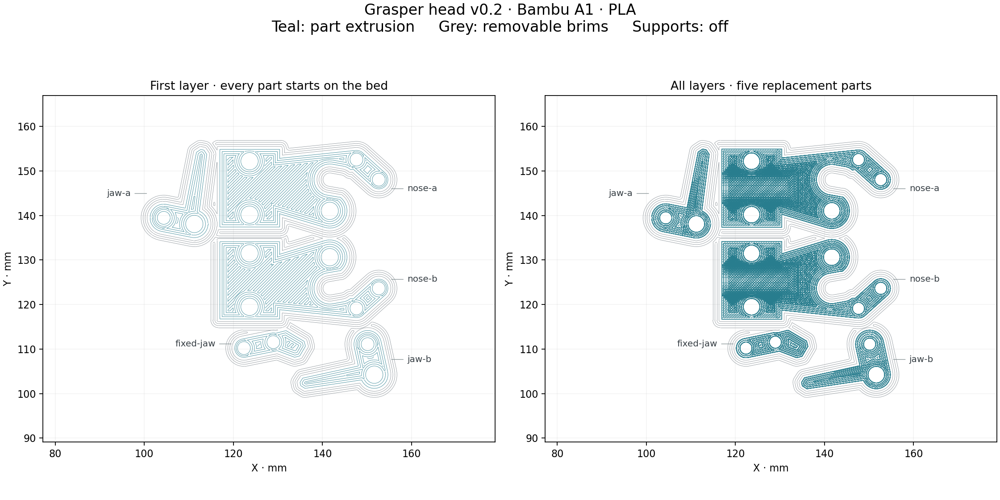

# Bambu A1 — v0.2 replacement head

This slice includes the reinforced cheek webs. Print only the five replacement head pieces. Reuse the successful handle prints.

**Estimate: 33 minutes 32 seconds, 4.49 g of PLA.** Settings: A1, 0.4 mm nozzle, ordinary PLA, textured PEI, 0.16 mm layers (0.20 mm first), four walls, 50% gyroid, 2 mm outside brims, **supports disabled**. Nozzle 220 °C; bed 65 °C.

1. Confirm the nozzle, plate, and loaded filament match these settings.
2. Open [the 3MF project](grape-grasper-head-v02-A1-PLA.3mf) **as a project** in Bambu Studio. Keep the saved orientations and all five objects. If the printer/material/plate differs, select the correct settings and slice again.
3. Review the preview and enable bed leveling. Leave timelapse off. Send the plate through Bambu Studio, or copy [the G-code](grape-grasper-head-v02-A1-PLA.gcode) to the printer's microSD card. Fox.Build documents both methods on its [A1 equipment page](https://fox.build/equipment/bambu-a1-3d-printers/).
4. Watch the first layer. Each part should begin directly on the bed. Let the plate cool before removal, then trim the brims and clean the mating faces.
5. Follow the [head assembly guide](../../docs/HEAD-V02.md).

The head has been redesigned to eliminate raised unsupported fingers, not just sliced with supports unchecked. The five meshes have continuous bed faces and no raised horizontal undersides. Short internal bridge regions over infill are present; no support paths are generated. The print is still awaiting its first physical fit test.

The command-line Bambu Studio export lacks an embedded thumbnail; the separate image shows the actual exported toolpaths. The editable project includes the sliced G-code. Re-slicing in Bambu Studio regenerates its native preview. Source hashes and settings are recorded in [slice-checks.json](slice-checks.json).
