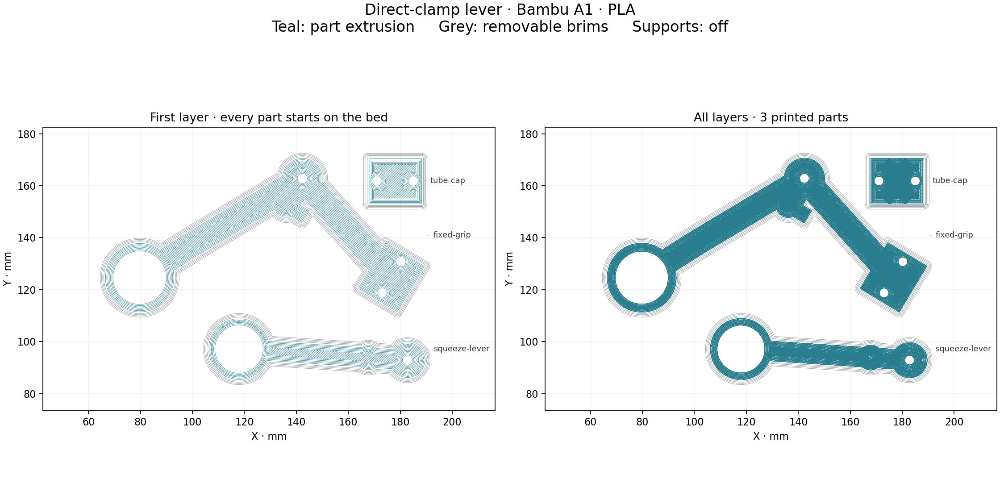

# Bambu A1 — direct-clamp lever handle

Print one fixed grip, one squeeze lever, and one tube cap. Reuse the assembled v2 head and 116 mm tube; the wire may need to be longer.

**Estimate: 1 hour 32 minutes 43 seconds, 19.12 g PLA.** Bambu A1, 0.4 mm nozzle, textured PEI, 0.16 mm layers (0.20 mm first), five walls, 60% gyroid, 2 mm outside brims, supports off.

1. Open [the 3MF](grape-grasper-lever-A1-PLA.3mf) **as a project** in Bambu Studio. Confirm the actual printer, nozzle, plate, and filament match. Reslice if they differ.
2. Keep all three objects and their saved orientations. Each broad face starts on the bed. The wire passage and side-loading M2 nut pocket contain short bridges.
3. Review the toolpaths, enable bed leveling, and leave timelapse off. Send through Bambu Studio or export the sliced G-code to a microSD card.
4. Watch the first layer. Let the bed cool, remove brims, and clean the passage and nut pocket before assembly.
5. Follow the [lever-handle assembly guide](../../docs/LEVER-HANDLE.md).

The [slice checks](slice-checks.json) compare the actual embedded meshes with the source STLs and confirm all three objects start on the bed, the extrusion stays within the plate, supports are absent, and the G-code checksum matches. The command-line export lacks a native thumbnail; the image above comes from the actual G-code. Reslicing in Bambu Studio regenerates its own preview.

This handle is awaiting its first physical print and motion test.
